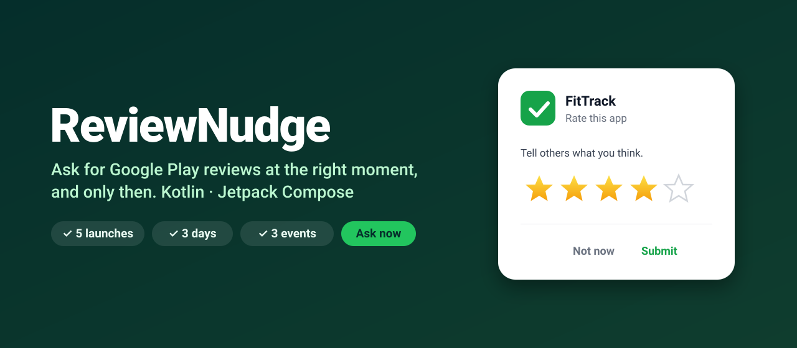
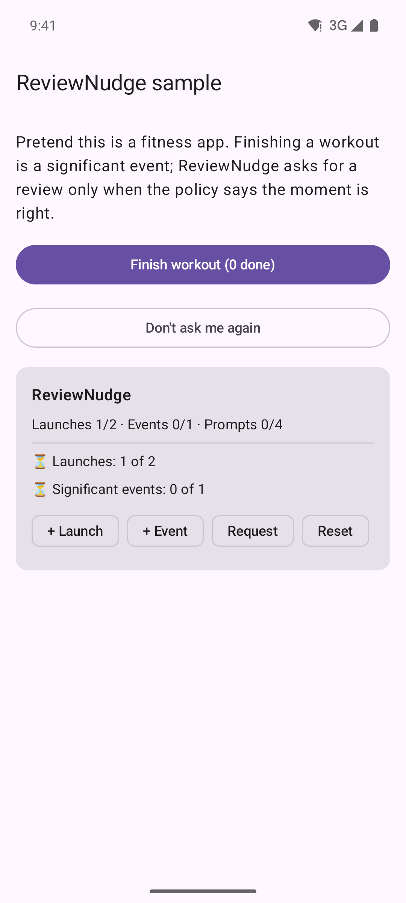
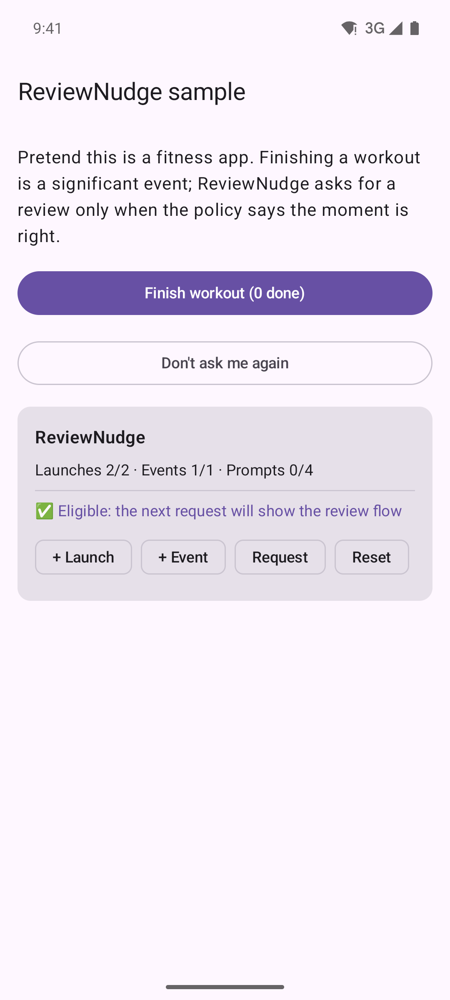
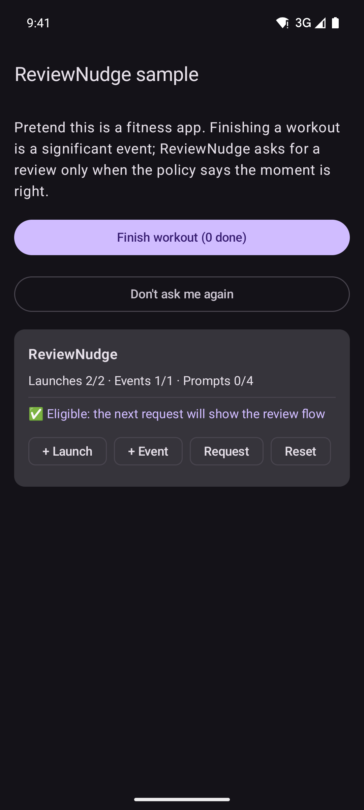

<p align="center">
  
</p>

<p align="center">
  <a href="https://github.com/halilozel1903/ReviewNudge/actions/workflows/ci.yml"></a>
  <a href="https://jitpack.io/#halilozel1903/ReviewNudge"></a>
  
  
  
  <a href="LICENSE"></a>
</p>

**ReviewNudge** decides *when* to show Google Play's in-app review dialog. You record launches and good moments; it checks a clear, testable policy (launches, days since install, significant events, cooldown, per-version and lifetime limits) and launches the Play flow only when every condition holds.

```kotlin
nudge.recordSignificantEvent()               // user finished a workout
nudge.requestReviewIfEligible(activity)      // shows Play's dialog only if the policy says yes
```

## Screenshots

Captured from the sample app on an Android emulator by CI.

| Not yet (blockers listed) | Eligible | Dark mode |
| :---: | :---: | :---: |
|  |  |  |

## Why

Google Play's review API gives you the dialog, but no strategy. Ask too early and you get angry one-star ratings; ask too often and Play silently stops showing the dialog because of its quota. Most apps end up with a hand-rolled `SharedPreferences` counter scattered across screens. ReviewNudge replaces that with one policy object, persisted state and a debug panel to tune it.

## Features

- 🧠 **Policy engine**: launches, days since install, significant events, cooldown, per-version and lifetime limits, opt-out.
- 🔍 **Explains itself**: every "not yet" comes with a list of blockers (`Launches: 2 of 5`, `Cooling down: 12d 4h left`).
- 💾 **Persistent** with Jetpack DataStore, or plug in your own `ReviewStore`.
- 🎯 **Google Play in-app review** via `review-ktx`, with a switch for `FakeReviewManager` in debug builds.
- 🧩 **Compose APIs**: `rememberReviewNudge()`, `ReviewPromptEffect(trigger)` and a drop-in `ReviewNudgeDebugPanel`.
- 🧪 **Pure Kotlin core** (`reviewnudge-core`) with no Android dependency, fully unit tested with an injectable clock.
- ✅ **Play-policy friendly**: no "Do you like the app?" gate before the prompt, which Google Play's guidelines forbid.

## Installation

Add JitPack to `settings.gradle.kts`:

```kotlin
dependencyResolutionManagement {
    repositories {
        google()
        mavenCentral()
        maven("https://jitpack.io")
    }
}
```

Then the dependency:

```kotlin
dependencies {
    implementation("com.github.halilozel1903.ReviewNudge:reviewnudge:1.0.0")
    // Pure Kotlin policy engine only (for KMP/JVM modules):
    // implementation("com.github.halilozel1903.ReviewNudge:reviewnudge-core:1.0.0")
}
```

> The build is also set up for Maven Central (`io.github.halilozel1903:reviewnudge`) via the vanniktech publish plugin.

## Quick start

**1. Create it once and count launches**

```kotlin
class App : Application() {
    lateinit var reviewNudge: ReviewNudge

    override fun onCreate() {
        super.onCreate()
        reviewNudge = ReviewNudge.create(
            context = this,
            policy = ReviewPolicy.Default,
            useFakeReviewManager = BuildConfig.DEBUG,
        )
        appScope.launch { reviewNudge.recordLaunch() }
    }
}
```

**2. Record good moments**

```kotlin
viewModelScope.launch { reviewNudge.recordSignificantEvent() }        // workout finished
viewModelScope.launch { reviewNudge.recordSignificantEvent(weight = 3) } // first 10k run!
```

**3. Ask at a natural pause**

```kotlin
// Views
lifecycleScope.launch {
    when (val outcome = reviewNudge.requestReviewIfEligible(this@MainActivity)) {
        ReviewOutcome.Launched -> analytics.log("review_flow_launched")
        is ReviewOutcome.Skipped -> Log.d("Review", outcome.blockers.joinToString { it.describe() })
        is ReviewOutcome.Failed -> Log.w("Review", outcome.error)
    }
}

// Compose: fires when `trigger` changes and the policy allows it
ReviewPromptEffect(nudge = reviewNudge, trigger = completedWorkout?.id)
```

## Policies

| | `Eager` | `Default` | `Patient` |
| --- | --- | --- | --- |
| Launches | 2 | 5 | 10 |
| Days since install | 0 | 3 | 7 |
| Significant events | 1 | 3 | 5 |
| Cooldown (days) | 30 | 60 | 120 |
| Per version | 1 | 1 | 1 |
| Lifetime | 4 | 4 | 3 |

Or write your own:

```kotlin
val policy = ReviewPolicy(
    minLaunches = 3,
    minDaysSinceInstall = 2,
    minSignificantEvents = 2,
    cooldownDays = 90,
    maxPromptsPerVersion = 1,
    maxPromptsTotal = 3,
    resetEventsOnNewVersion = true,
)
```

## Debug panel

```kotlin
if (BuildConfig.DEBUG) {
    ReviewNudgeDebugPanel(nudge = reviewNudge)
}
```

It shows the live counters and every blocker, with buttons to add launches and events, request a review, and reset.

## Testing your own logic

`reviewnudge-core` is plain Kotlin, so policies can be tested without Robolectric:

```kotlin
val tracker = ReviewTracker(
    store = InMemoryReviewStore(),
    policy = ReviewPolicy.Eager,
    appVersion = "1.0",
    clock = { fakeNow },
)
tracker.recordLaunch()
tracker.recordLaunch()
tracker.recordSignificantEvent()
assertTrue(tracker.currentDecision().isEligible)
```

## Good to know

- Google Play shows the dialog at most a few times per user per year and never tells the app whether the user rated. `ReviewOutcome.Launched` means "handed to Play", not "rated".
- Only production installs from Play show the real dialog. Use `useFakeReviewManager = true` or Play's [internal app sharing](https://developer.android.com/guide/playcore/in-app-review/test) for testing.
- Don't ask users a question before the prompt, and don't trigger it from a button that promises a reward. See [Play's guidelines](https://developer.android.com/guide/playcore/in-app-review#when-to-request).

## Project structure

| Module | What it is |
| --- | --- |
| `reviewnudge-core` | Pure Kotlin policy engine, tracker and store interface |
| `reviewnudge` | Android: DataStore store, Play review integration, Compose APIs |
| `sample` | A tiny "fitness" app that shows the whole flow |

## Tech stack

Kotlin 2.4 · AGP 9.4 with built-in Kotlin · Gradle 9.6 · Jetpack Compose (BOM 2026.09) · Material 3 · DataStore · Play In-App Review · Coroutines & Flow · GitHub Actions

## License

MIT. See [LICENSE](LICENSE).
